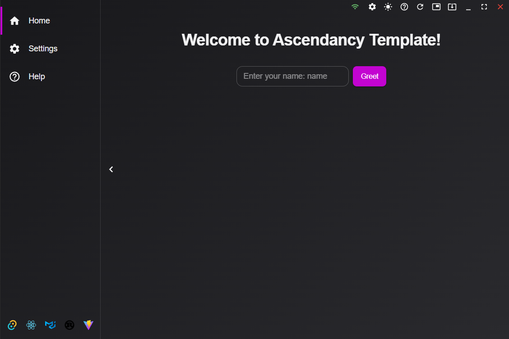

# Tauri Template


A cross-platform desktop application template built with Tauri, React, TypeScript, and Material-UI. This template provides a modern UI with internationalization, theme switching, and system tray integration.

## ✨ Features

- **Custom Titlebar**: Includes minimize, maximize, and theme toggle buttons.
- **Network Status Dialog**: Displays SSID and signal strength.
- **Internationalization**: Supports English and Russian languages.
- **Theme Switching**: Light, Dark, and Custom themes.
- **Smooth Scrolling**: Powered by `smooth-scrollbar`.
- **System Tray**: Seamless integration for quick access.

## 📸 Screenshots




## 🚀 Getting Started

### Prerequisites

- Node.js (v16 or higher)
- Rust (v1.59 or higher)
- Tauri CLI

### Installation

1. Clone the repository:

   ```bash
   git clone https://github.com/your-username/tauri-template.git
   cd tauri-template
   ```

2. Install dependencies:

   ```bash
   npm install
   ```

3. Run the application in development mode:

   ```bash
   npm run tauri dev
   ```

4. Build the application for production:

   ```bash
   npm run tauri build
   ```

🛠️ Usage

- Launch the app to explore the custom titlebar, theme switching, and network status dialog.
- Use the system tray to access quick actions.
- Switch languages via the settings menu (English/Russian).

## 📂 Project Structure

```
tauri-template/
├── src/                # React frontend code
├── src-tauri/          # Tauri backend (Rust)
├── public/             # Static assets
├── screenshots/        # Screenshots for README
└── README.md
```

## 🤝 Contributing

Contributions are welcome! Please follow these steps:

1. Fork the repository.
2. Create a new branch (`git checkout -b feature/your-feature`).
3. Commit your changes (`git commit -m 'Add your feature'`).
4. Push to the branch (`git push origin feature/your-feature`).
5. Open a Pull Request.

## 📜 License

This project is licensed under the MIT License - see the LICENSE file for details.

## 📞 Contact

- Open an issue on GitHub.

## 🛠️ Troubleshooting

- **Error: Rust not found**: Ensure Rust is installed (`rustc --version`).
- **Tauri CLI fails**: Run `cargo install tauri-cli` to install the CLI.
